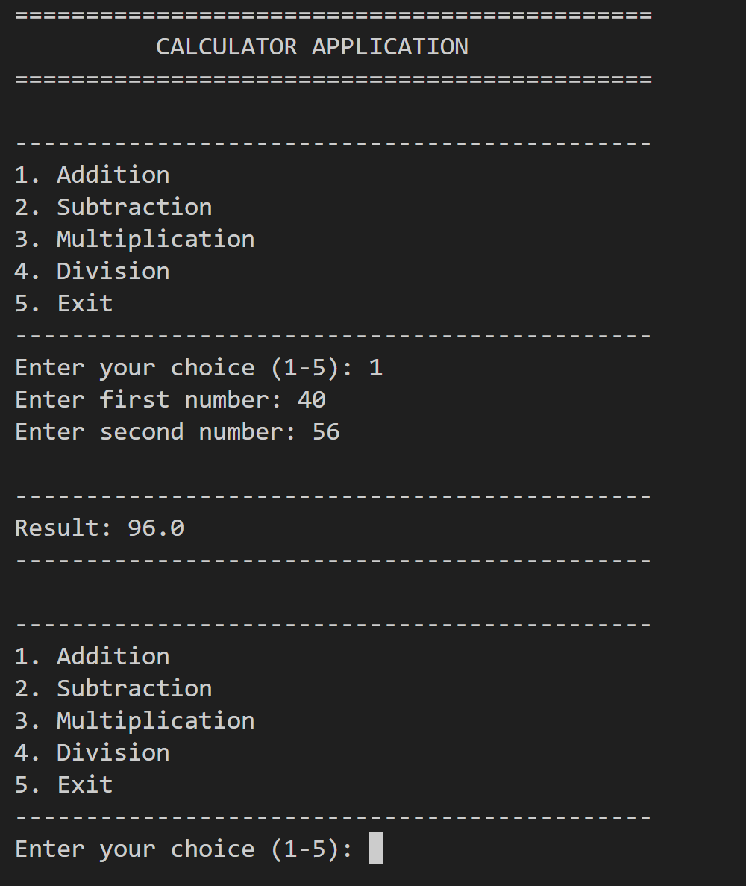

# Calculator Application

A clean and user-friendly command-line calculator built with Python as part of the **Sathtern Python Development Virtual Internship**.

## Overview

The Calculator Application performs basic arithmetic operations through a simple menu-driven command-line interface.

The project focuses on clean code structure, input validation, error handling, and automated testing.

## Features

- Addition
- Subtraction
- Multiplication
- Division
- Integer and decimal number support
- Negative number support
- Menu-driven command-line interface
- Input validation
- Division-by-zero protection
- Invalid menu-choice handling
- Repeated calculations without restarting
- Clean application exit
- Modular function-based structure
- Automated testing with Python's `unittest`
- No external dependencies

## Technologies Used

- **Python 3.10+**
- **unittest** - automated testing
- **Git & GitHub** - version control and project hosting

## Project Structure

```text
Sathtern_Calculator/
|
|-- src/
|   `-- calculator.py
|
|-- tests/
|   `-- test_calculator.py
|
|-- screenshots/
|-- .gitignore
|-- README.md
`-- requirements.txt
```

## Getting Started

### 1. Clone the repository

```powershell
git clone https://github.com/ghufran-ai-08/Sathtern_Calculator.git
cd Sathtern_Calculator
```

### 2. Create a virtual environment

**Windows PowerShell:**

```powershell
python -m venv .venv
```

### 3. Activate the virtual environment

```powershell
.\.venv\Scripts\Activate.ps1
```

### 4. Run the calculator

```powershell
python src\calculator.py
```

## Usage

After starting the application, select an operation from the menu:

1. Addition
2. Subtraction
3. Multiplication
4. Division
5. Exit

Enter the requested numbers when prompted.

The calculator displays the result and returns to the menu so additional calculations can be performed.

## Example

```text
=============================================
          CALCULATOR APPLICATION
=============================================

---------------------------------------------
1. Addition
2. Subtraction
3. Multiplication
4. Division
5. Exit
---------------------------------------------

Enter your choice (1-5): 1

Enter first number: 25
Enter second number: 15

---------------------------------------------

Result: 40.0

---------------------------------------------
```

## Error Handling

The application handles common user errors without terminating unexpectedly.

### Invalid Menu Choice

```text
Enter your choice (1-5): abc

Invalid choice. Please select an option from 1 to 5.
```

### Invalid Number

```text
Enter first number: hello

Invalid input. Please enter a valid number.
```

### Division by Zero

```text
Error: Cannot divide by zero.
```

## Testing

The project includes automated tests using Python's built-in `unittest` framework.

The test suite covers:

- Addition
- Subtraction
- Multiplication
- Division
- Division by zero
- Decimal calculations
- Negative numbers
- Invalid numeric input
- Empty input
- Invalid menu choices
- Out-of-range menu choices
- Operation selection

Run the tests with:

```powershell
python -m unittest discover -s tests -v
```

### Current Test Status

```text
Ran 16 tests

OK
```

## Screenshots



## Internship Context

This project was developed as Project 2 during the Sathtern Python Development Virtual Internship.

The project implements the requirements for the Calculator Application task while emphasizing practical software development practices such as modular design, validation, error handling, testing, documentation, and Git version control.

## Author

**Muhammad Ghufran**
